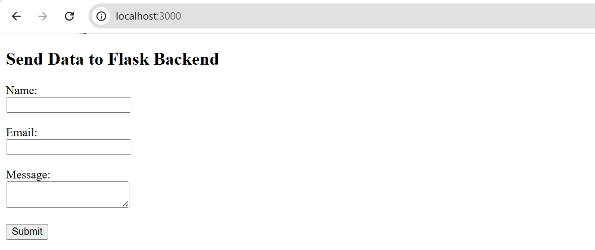
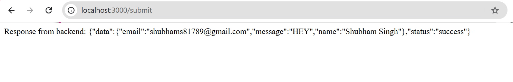
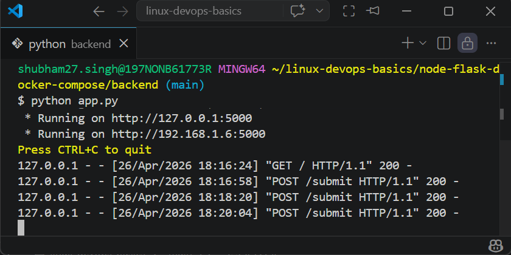
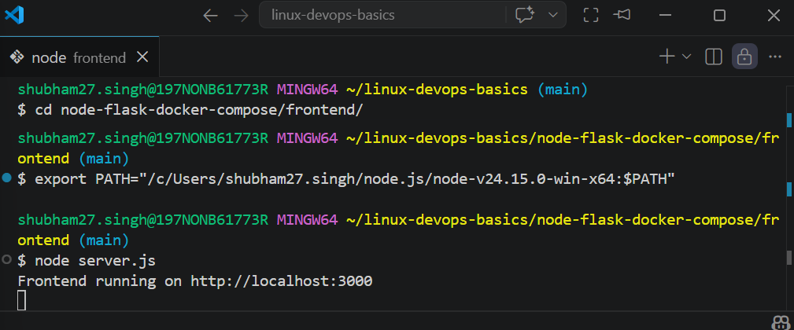

# 🚀 Node + Flask Docker Application

A full-stack application where a Node.js (Express) frontend communicates with a Flask backend. The project is containerized using Docker and managed with Docker Compose.

---

## 📌 Features

- Node.js frontend with form
- Flask backend to process form data
- Communication between frontend and backend
- Dockerized services
- Docker Compose for multi-container setup

---

## 🛠️ Technologies Used

- Node.js (Express)
- Python (Flask)
- Docker
- Docker Compose

---

## 📂 Project Structure

node-flask-docker-compose/
├── frontend/
│   ├── server.js
│   ├── package.json
│   ├── Dockerfile
│   └── index.html
│
├── backend/
│   ├── app.py
│   ├── requirements.txt
│   └── Dockerfile
│
├── docker-compose.yaml
├── .gitignore
└── README.md

---

## ▶️ How It Works

1. User fills the form in Node frontend
2. Frontend sends POST request to Flask backend
3. Flask processes and returns response
4. Frontend displays response

---

## 🧪 Running Locally (Without Docker)

### Backend

cd backend  
pip install -r requirements.txt  
python app.py  

---

### Frontend

cd frontend  
npm install  
node server.js  

---

### Open in Browser

http://localhost:3000

---

## 🐳 Docker Setup

### Backend Dockerfile

- Uses Python base image
- Installs dependencies
- Runs Flask app

### Frontend Dockerfile

- Uses Node.js image
- Installs dependencies
- Runs Express server

---

## 📦 Docker Compose

docker-compose.yaml connects:

- frontend → port 3000
- backend → port 5000

Services communicate using:

http://backend:5000

---

## ⚠️ Note

Docker could not be executed locally due to system restrictions (admin permissions required). However, Dockerfiles and docker-compose configuration are correctly implemented.

---

## 📸 Screenshots

### Frontend Form

### Form Submission Response

### Backend Running

### Frontend Running

---

## 🔗 GitHub Repository

https://github.com/Shubhams260/node-flask-docker-compose