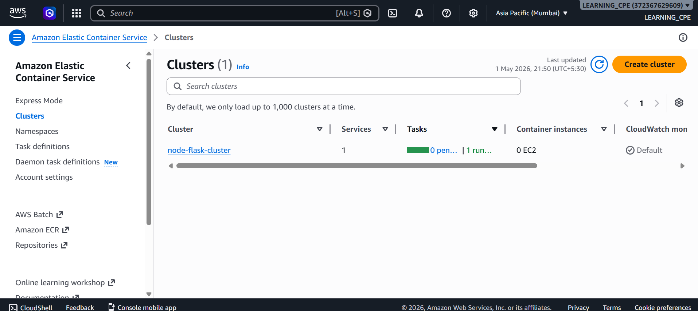
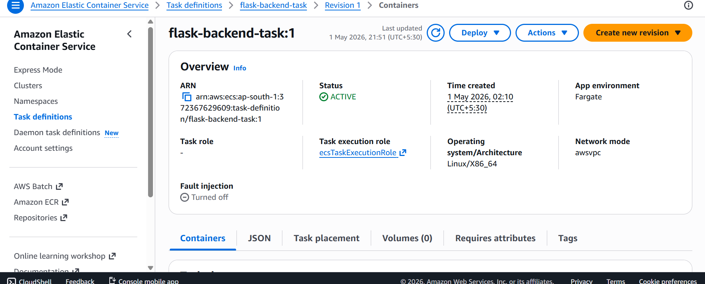
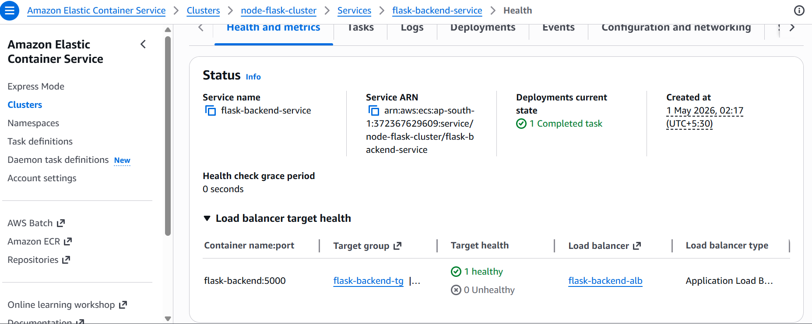
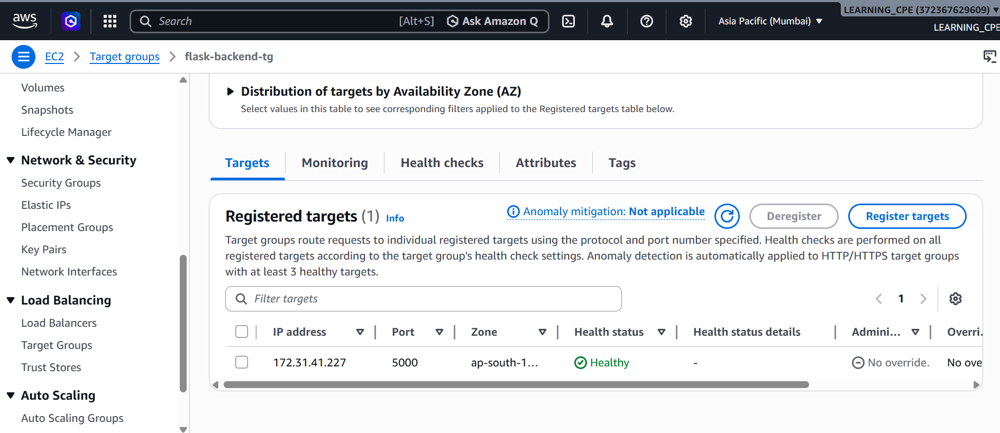
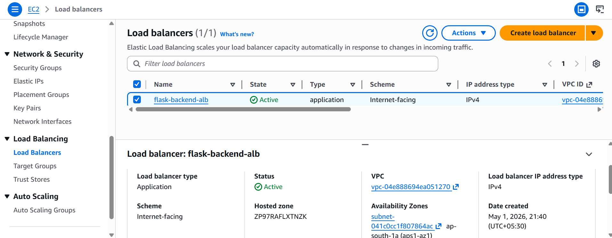
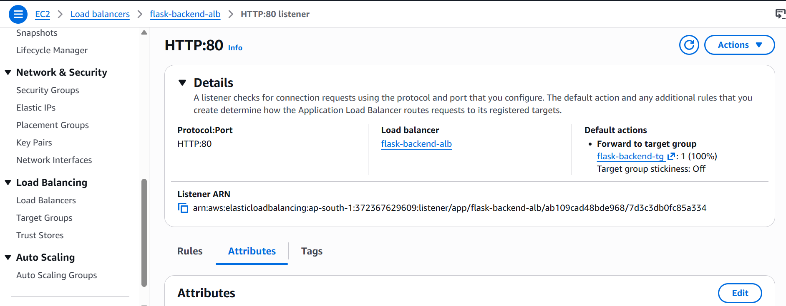
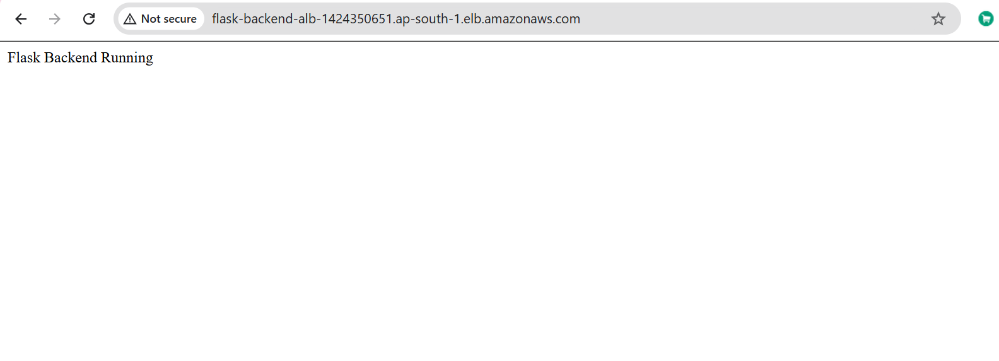

# 🚀 Part 3: ECS Fargate Deployment with Application Load Balancer

## 📌 Overview
In this phase, the application is deployed using **AWS ECS (Fargate)** and exposed to the internet using an **Application Load Balancer (ALB)**.

This setup represents a **production-like architecture** where containers are managed without servers.

---

## 🧱 Architecture

User → ALB (HTTP:80)  
↓  
Target Group  
↓  
ECS Fargate Task (Flask Backend - Port 5000)

---

## 🧰 AWS Services Used

- Amazon ECS (Fargate)
- Amazon ECR
- Application Load Balancer (ALB)
- Target Group
- CloudWatch Logs

---

## 🔨 Implementation Steps

### 1️⃣ Docker & ECR Setup
- Built backend Docker image
- Tagged and pushed image to AWS ECR
- Verified image in ECR repository

---

### 2️⃣ ECS Cluster & Task Definition
- Created ECS Cluster (Fargate)
- Created Task Definition for backend container
- Configured CPU, memory, port 5000, and logging

---

### 3️⃣ ECS Service Deployment
- Created ECS Service with desired tasks = 1
- Enabled public networking
- Configured security group (port 5000)

---

### 4️⃣ Issue Faced 🚧
Backend was not accessible using Public IP even though:
- Container was running
- Logs showed app running on 0.0.0.0:5000

---

### 5️⃣ Solution ✅
- Created Target Group (port 5000)
- Created Application Load Balancer (HTTP:80)
- Configured Listener to forward traffic
- Attached ECS service to Target Group

---

### 6️⃣ Final Result 🎯
Backend successfully accessible using ALB DNS URL.

---

## 📸 Screenshots

### ECS Cluster

### Task Definition

### ECS Service Running

### Target Group Healthy

### ALB Created

### Listener Configuration

### Backend Working

---

## 🌐 Final Output

Application accessible via:

http://http://flask-backend-alb-1424350651.ap-south-1.elb.amazonaws.com/

---

## 🧠 Key Learnings

- Difference between EC2 and Fargate deployment
- Importance of Load Balancer in containerized apps
- Debugging container networking issues
- ECS integration with ECR, ALB, and Target Groups

---

## ⚠️ Notes

- Flask development server used for learning
- In production:
  - Use Gunicorn
  - Add HTTPS (SSL)
  - Enable Auto Scaling

---

## 👨‍💻 Author

Shubham Singh